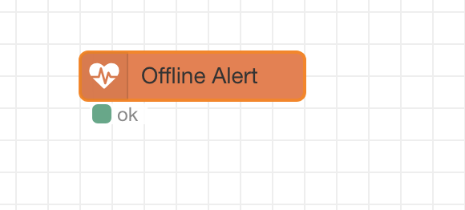
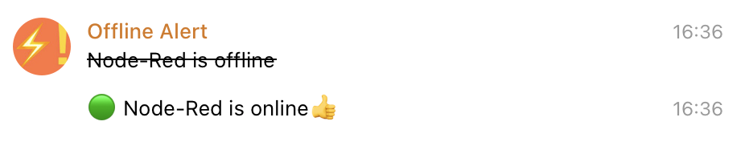

# Node-RED Offline Alert Module

Using Node-RED for remote location monitoring? Great idea—but who’s watching the watcher?

Ensure basic health monitoring of your Node-RED instance with this module.

A dedicated Telegram bot will notify you immediately in case of power outages or internet disruptions, keeping you informed even when the unexpected happens.

 

## Overview

This module allows you to receive Telegram notifications when Node-RED loses its Internet connection.

Once enabled, the module sends periodic HTTPS requests to the maintainer's server. If the server detects that no requests have been received for a certain period, it sends you a notification via Telegram.

This way, you can be informed if the computer running Node-RED has gone offline or even shut down completely, for instance, due to a power outage.

No need to panic, though—it could be a temporary network issue or even a false alarm. When Node-RED comes back online, you will also receive a notification.

## Install

```
$ npm install @nickiv/node-red-offline-alert
```

## Usage

This module has only one node without inputs or outputs. To use the node, you need to fill in the Slot ID configuration.

To get a Slot ID, follow the link to the Telegram bot. The link is provided in the node's settings.

The Slot ID is required for the monitoring server to identify which user should receive a notification in case a disconnection is detected.

The monitoring status is displayed in the node's status. If you need to process this status, use the status node.